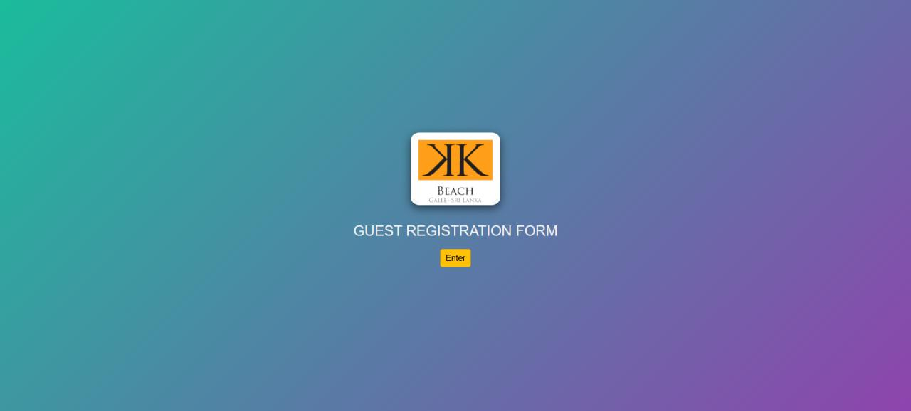
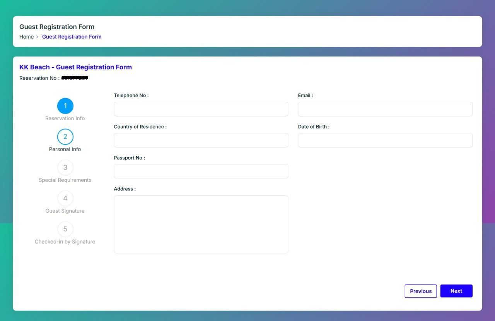
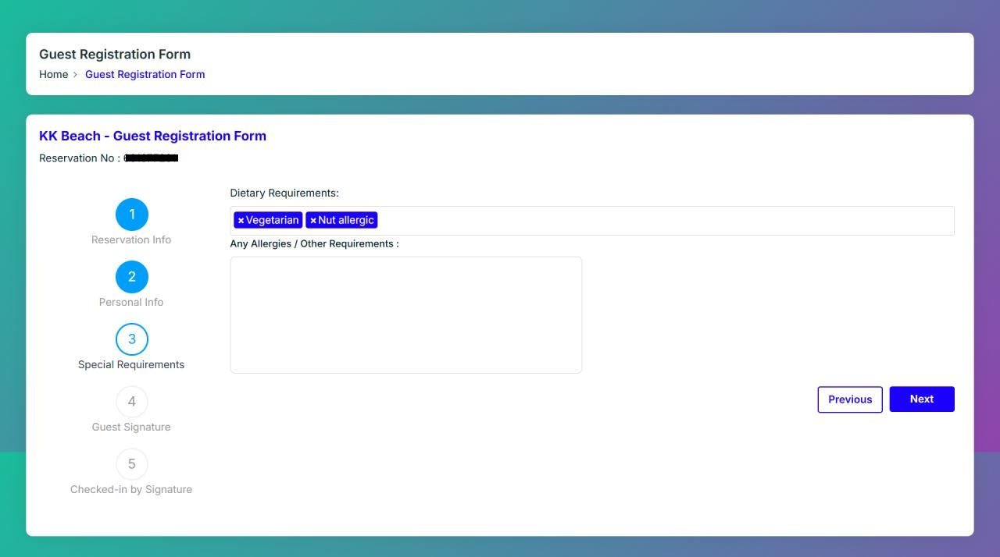
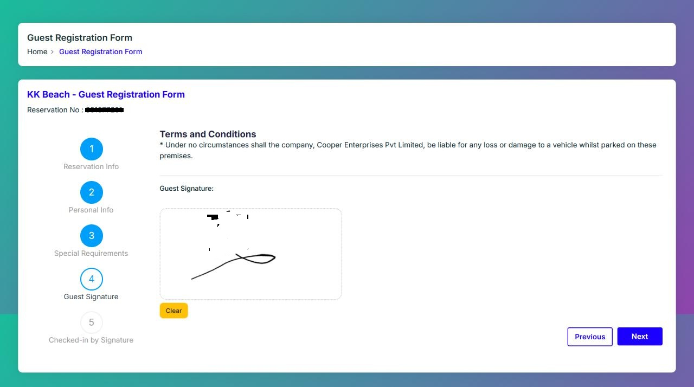
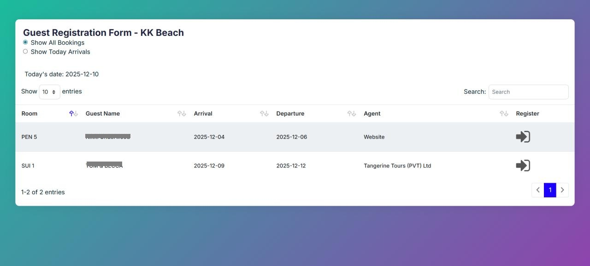
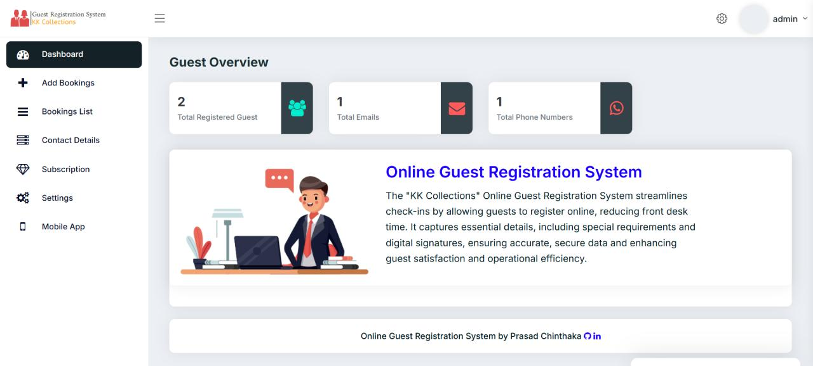
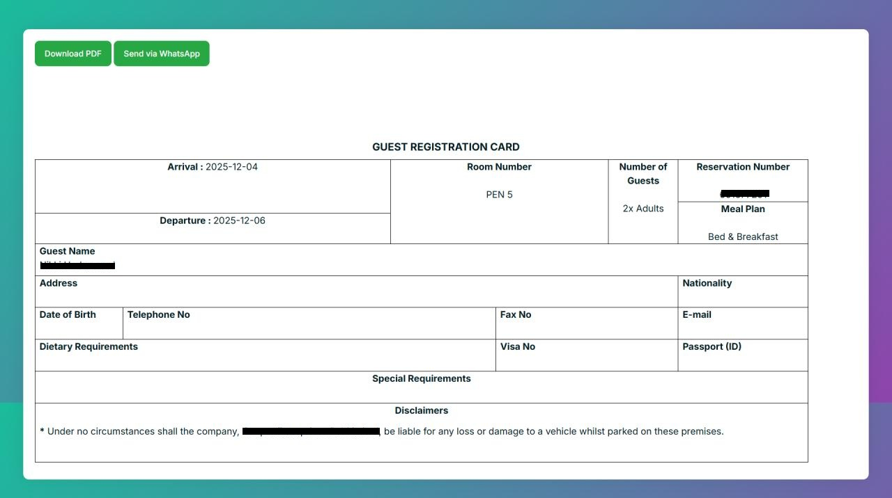
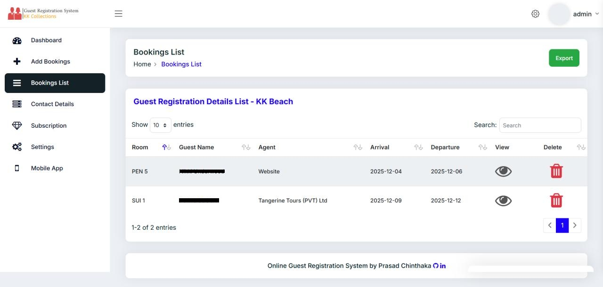

# Digital Guest Registration System – KK Collection

A specialized digital transformation project developed for **KK Collection** to replace traditional paper-based Guest Registration Cards (GRC). This system modernizes the check-in experience while providing a robust management backend for boutique hotel operations.

---

## 🛑 The Problem: The Paper Crisis
Boutique hotels face significant operational friction with paper registration:
* **Logistics:** High cost and difficulty in sourcing quality paper.
* **Storage:** Physical forms are prone to damage and require extensive filing space.
* **Retrieval:** Searching for a specific guest from a previous year is manually intensive.
* **Data Silos:** No centralized digital database for marketing and guest preference tracking.

---

## ✅ The Solution
I developed a multi-platform digital ecosystem that centralizes guest data across multiple properties (KK Beach, Kahanda Kanda, and The Villa Bentota).

### **Key Components:**
1. **Android Tablet Interface:** A user-friendly, 5-tab registration flow for guest self-check-in.
2. **Admin Panel:** Built with PHP/MySQL for reservation management and data analysis.
3. **Automation Suite:** * Automatic PDF GRC generation.
   * **WhatsApp Integration:** Instant delivery of completed forms to Duty Managers.
   * **Digital Signature:** Captures guest agreement electronically.

---

## 🚀 Impact & Efficiency
* **Cost Reduction:** Achieved zero paper usage for guest registrations.
* **Instant Search:** Guest history and contact details are now searchable in seconds.
* **Streamlined Check-in:** Faster, more professional arrival experience.
* **Improved Communication:** Duty Managers stay updated in real-time via automated notifications.

---

## 🛠 Technology Stack
* **Backend:** PHP (Core) & MySQL
* **Frontend:** HTML5, CSS3, Bootstrap 5
* **Mobile:** Android Tablet App (WebView/Integrated)
* **Features:** PDF Generation, Digital Signature Canvas, Excel Data Import.

---

## 📸 System Walkthrough
> *The following screenshots demonstrate the workflow from arrival to admin management.*

### **Guest Experience**
| Enter Page | Personal Information |
|---|---|
|  |  |

| Special Requirements (Dietary) | Digital Signature |
|---|---|
|  |  |

### **Front Office & Admin Dashboard**
| Today’s Arrivals | Admin Summary |
|---|---|
|  |  |

| GRC Preview & Export | Booking Directory |
|---|---|
|  |  |

---

## 🔒 Confidentiality & IP
This project was developed exclusively for **KK Collection** via **Tecpins Web Solutions**. The source code and specific database schemas are proprietary. 

---

### 👨‍💻 Developed By
**Prasad Chinthaka** *Full-Stack Developer | Tecpins Web Solutions* [Website](https://tecpinswebsolutions.lk/)
